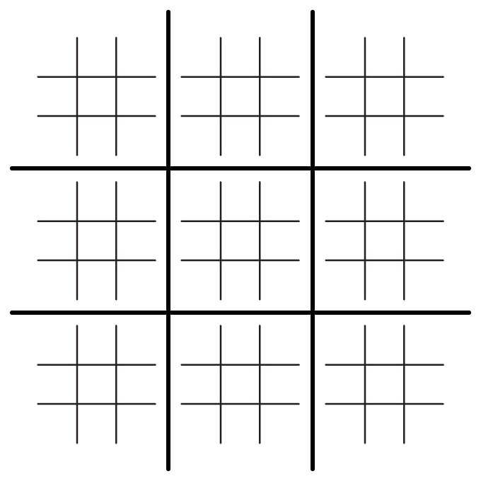
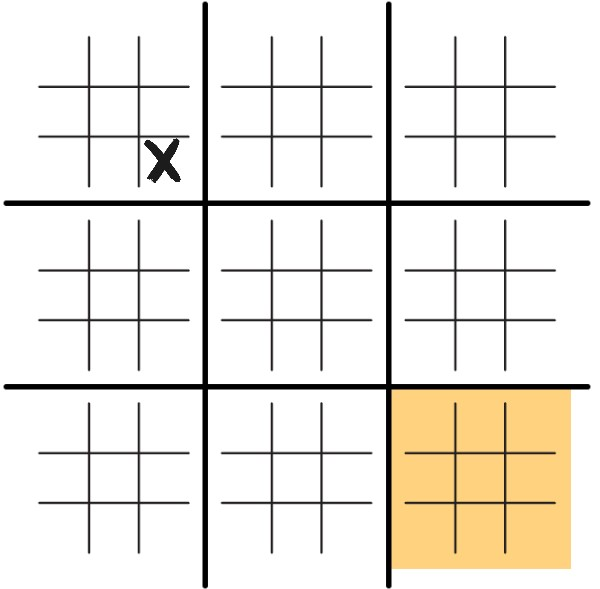

# Tic-Tac-Toe
### Check it out [here](https://madavidcoder.github.io/Ultimate-Tic-Tac-Toe)!

Ultimate Tic-Tac-Toe is a variation of the very well-known game, Tic-Tac-Toe (also known as Noughts and Crosses).

## Rules
The Ultimate Tic-Tac-Toe grid is similar to the conventional Tic-Tac-Toe grid, but inside each of the nine large squares, is an additional 3x3 grid.

To win the game, you must win three large squares in a row. To win each large square, you have to get a three in a row within the smaller grid.  

To start the game, X can play anywhere. Like in the standard version, O then goes next. But there's a twist. The small grid that O must play in, is determined by where X played. For example, if X played in the bottom-right square of its smaller grid, O would have to play in the bottom-right grid.

The game then continues similarly, with the grid for the next move being determined by the last move. If the grid has already been won, the next player can move anywhere.